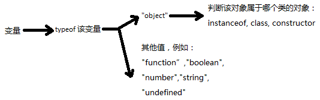

# 第4章 表达式和运算符

## 4.7 运算符概述

### 4.7.2 操作数类型和结果类型

js中所有类型的值不是真值就是假值，即：任意类型的数都能转化为布尔类型的 true或 false，所以对于那些希望操作数为布尔类型的操作符来说，它们的操作数可以是任意类型。

---

## 4.13 其他运算符

### 4.13.2  typeof 运算符

用法： typeof 变量，  或  typeof(变量)

返回值：始终是一个字符串，但根据变量类型的不同，返回的字符串内容不同

| x                            | typeof x                                                     |
| ---------------------------- | ------------------------------------------------------------ |
| undefined                    | "undefined"                                                  |
| null, 任意内置对象（非函数） | “object”                                                     |
| true, false                  | "boolean"                                                    |
| 任意数字，NaN                | "number"                                                     |
| 任意字符串                   | “string”                                                     |
| 任意函数                     | “function”                                                   |
| 任意宿主对象                 | 由编译器各自实现的字符串，但不是 "undefined"、"boolean"、"number"或 “string” |

**注意：虽然函数也属于一种对象，但是对函数使用 typeof 运算的结果不是 "object"，而是 "function".**

函数是一种可执行对象，但可执行对象不仅仅有函数还有其他对象.

ES5规定：所有可执行对象进行 typeof 运算都将返回 “function”.

如果使用 typeof 运算判断出一个变量是 object类型，那么还可以进一步使用 instanceof运算符 (c4.9.4), class特性 (c6.8.2), constructor 属性 (c6.8.1  c9.2.2) 等来判断该对象是属于哪个类，如下图：

---

### 4.13.3  delete 运算符

delete 的作用：删除对象属性， 或删除数组元素

delete 的用法：delete 对象.属性    或  delete 数组[下标]

delete 的结果：

- delete 对象属性：delete 对象属性后，该对象中该属性将不再存在（即：对该属性名在该对象上使用in运算会返回 false），获取该对象的该属性的值将返回 undefined（注意：返回 undefined有两种可能的情况：要么是该对象中不存在该属性，要么是该对象中存在该属性但该属性的数值刚好为 undefined）
- delete 数组元素：delete 数组元素，相当于将该数组中该元素的数值设置为 undefined， 数组长度不变。

