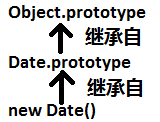

# 第6章 对象

## 6.1 创建对象

### js创建对象的方式：

- 字面量（直接量）. 形式类似于json

- new 构造函数.

- Object.create(proto[, propertiesObject]). 一个非Object.prototype 的对象从其原型对象中继承属性， 而所有的原型对象最终都会继承Object.prototype 的属性，所以一个非Object.prototype 的对象既会继承其原型对象的属性又会继承Object.prototype 的属性。例如：new Date()对象既继承了 Date.prototype 的属性，又继承了 Object.prototype 的属性.

  

  例如：

  ```
  var o1 = Object.create({x:1, y:2}); // 参数{x:1, y:2}就是对象o1的原型对象，o1继承了属性x和y
  ```


### 什么是原型？

- 原型是一个对象（通常也冗余地称为“原型对象”）
- 原型是一个相对概念，正确的说法应该是，某个对象是另一个对象的原型
- 任何非 Object.prototype 的对象都有自己的一个直接原型和可能存在的多个间接原型，这些原型的根原型是 Object.prototype
- 只有 Object.prototype 没有原型
- 一个对象可以从其原型（直接原型和间接原型）中继承属性和方法，最终这个继承关系形成的链条就叫做原型链.


---

# 6.2 属性的查询和设置

> js 作为弱类型语言，对象的属性是可以进行增删改查的，尤其是增删 (这是和强类型语言的区别). ------- <font color="red">这句话不知道说的对不对，待本章节看完后回头再修改</font>
>
> 给属性赋值，如果存在该属性（例如：存在非只读的自有属性，或者可以从原型继承来该属性），则是修改该属性的值；如果自有或者继承该属性都不ok，但该对象可扩展，则是为该对象新增该属性并赋值；否则，赋值失败。

## 6.2.1 作为关联数组的对象

### 属性的两种访问方式：

- 点号（即小数点）.

  用法：对象名.硬编码属性名

  注意：由于属性名不是数据类型，所以只能硬编码写死，所以就缺少了动态性.

- 中括号（即[“属性名”]）.

  用法：对象名[属性名的字符串变量或常量]

  注意：由于属性是字符串类型，属于一种数据类型，字符串可以是字面量也可以是变量，所以使用变量时就可以在运行时动态变化，所以有了动态性.

关联数组： 也叫散列（或哈希），映射或字典

## 6.2.2 继承

属性访问：按照原型链逐级向上查找，直到找到为止，或者知道找到根原型对象为止

属性赋值：如果属性存在（自由属性或者通过继承而来）并且该属性可以修改，那么该赋值操作就能成功。

> 属性赋值的一个特例：<font color="red">一个带有setter方法的 accessor 属性，在 6.6 章节中详细介绍（没看懂，看完6.6章节后回头总结）</font>

## 6.2.3 属性访问错误

给对象o设置属性p会失败的几种情况：

- o有只读的自有属性p
- o没有自有属性p，只有只读的继承属性p
- o没有自有属性p，o也没有setter方法从原型中继承来属性p（这种情况下只能新增该属性，但前提是要有可扩展性）同时o也不能扩展 (即：可扩展性为false)

js在一个对象不为null的前提下获取该对象的某个属性的写法举例：

例如：要获取一本书的标题长度，可以有以下两种等效的写法 (&& 是短路与)：

```
var len = undefined;
if(book && book.title){
  len = book.title.length;
}
```

或者更简洁的写法是： 

```js
var len = book && book.title && book.title.length;
```

