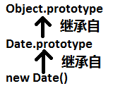

# 第6章 对象

## 6.1 创建对象

### js创建对象的方式：

- 字面量（直接量）. 形式类似于json

- new 构造函数.

- Object.create(proto[, propertiesObject]). 一个非Object.prototype 的对象从其原型对象中继承属性， 而所有的原型对象最终都会继承Object.prototype 的属性，所以一个非Object.prototype 的对象既会继承其原型对象的属性又会继承Object.prototype 的属性。例如：new Date()对象既继承了 Date.prototype 的属性，又继承了 Object.prototype 的属性.

  

  例如：

  ```javascript
  var o1 = Object.create({x:1, y:2}); // 参数{x:1, y:2}就是对象o1的原型对象，o1继承了属性x和y
  ```


### 什么是原型？

- 原型是一个对象（通常也冗余地称为“原型对象”）
- 原型是一个相对概念，正确的说法应该是，某个对象是另一个对象的原型
- 任何非 Object.prototype 的对象都有自己的一个直接原型和可能存在的多个间接原型，这些原型的根原型是 Object.prototype
- 只有 Object.prototype 没有原型
- 一个对象可以从其原型（直接原型和间接原型）中继承属性和方法，最终这个继承关系形成的链条就叫做原型链.


---

## 6.2 属性的查询和设置

> js 作为弱类型语言，对象的属性是可以进行增删改查的，尤其是增删 (这是和强类型语言的区别). ------- <font color="red">这句话不知道说的对不对，待本章节看完后回头再修改</font>
>
> 给属性赋值，如果存在该属性（例如：存在非只读的自有属性，或者可以从原型继承来该属性），则是修改该属性的值；如果自有或者继承该属性都不ok，但该对象可扩展，则是为该对象新增该属性并赋值；否则，赋值失败。

### 6.2.1 作为关联数组的对象

#### 属性的两种访问方式：

- 点号（即小数点）.

  用法：对象名.硬编码属性名

  注意：由于属性名不是数据类型，所以只能硬编码写死，所以就缺少了动态性.

- 中括号（即[“属性名”]）.

  用法：对象名[属性名的字符串变量或常量]

  注意：由于属性是字符串类型，属于一种数据类型，字符串可以是字面量也可以是变量，所以使用变量时就可以在运行时动态变化，所以有了动态性.

关联数组： 也叫散列（或哈希），映射或字典

### 6.2.2 继承

属性访问：按照原型链逐级向上查找，直到找到为止，或者知道找到根原型对象为止

属性赋值：如果属性存在（自由属性或者通过继承而来）并且该属性可以修改，那么该赋值操作就能成功。

> 属性赋值的一个特例：<font color="red">一个带有setter方法的 accessor 属性，在 6.6 章节中详细介绍（没看懂，看完6.6章节后回头总结）</font>

### 6.2.3 属性访问错误

给对象o设置属性p会失败的几种情况：

- o有只读的自有属性p
- o没有自有属性p，只有只读的继承属性p
- o没有自有属性p，o也没有setter方法从原型中继承来属性p（这种情况下只能新增该属性，但前提是要有可扩展性）同时o也不能扩展 (即：可扩展性为false)

js在一个对象不为null的前提下获取该对象的某个属性的写法举例：

例如：要获取一本书的标题长度，可以有以下两种等效的写法 (&& 是短路与)：

```js
var len = undefined;
if(book && book.title){
  len = book.title.length;
}
```

或者更简洁的写法是： 

```js
var len = book && book.title && book.title.length;
```

---

## 6.3 删除属性

在 [“4.13.3  delete 运算符“](./jsDG_chapter4_表达式和运算符.md) 介绍过，delete运算符可以删除对象的属性或数组的元素。

**在英文原版中，有两个单词都可以翻译为汉语的"属性"： property, attribute，而delete 删除的属性指的是 property.**

使用 delete 表达式删除对象的属性时，注意防止产生内存泄露，例如：

```js
var a = {
  p: {x:1}  // 这里的对象 {x:1} 我们简称作对象obj
};
var b = a.p; // 此时 b == obj, b也引用着对象obj，相当于对象obj有两个引用（a.p 和 b）
delete a.p; // 这句代码的本意是想让对象obj失去来自a.p的引用从而释放掉该对象所占用的内存，但是由于它还
// 存在另一个引用b, 从而导致对象obj在内存中占用的空间并未得到释放，而我们执行这句delete代码的本意也是
// 不想再继续使用该对象obj了，但是实际上经过delete后该对象依然没有被释放，就相当于被泄露到内存中了。
// 所以要想避免这种问题，就还需要把 b对它的引用给删除，可以再执行 delete b.x即可，但是这种解决办法不够
// 直观，所以一个好的习惯是，先删除a.p.x(即：先删除a.p自己的所有属性),然后再去删除 a.p 本身。
```

上述代码的注释详细阐述了对象obj 发生内存泄露的过程。下面的代码是避免obj 发生内存泄露的正确写法：

```js
var a = {
  p: {x:1}
};
var b = a.p; // 即：b == {x:1}， b.x == 1
delete a.p.x; // 此时 a.p.x == b.x == undefined，也就是遍历 a.p 的每一个属性并依次删除，当内部属性
// 较多时，可以使用for循环遍历并删除
delete a.p; // 当删除了 a.p 的所有属性后，再去删除 a.p本身，这样就能避免内部属性所引用的对象的内存泄露
```

delete只有删除自有属性时才会成功，删除继承属性将不起任何作用。

删除自有属性后，继承自该对象的对象在访问该属性时将也会受到影响。

继承属性无法删除，只能在定义该属性的那个原型对象中才能有效删除，删除后会同时影响到该对象的所有子对象。

delete 表达式的值为布尔类型，当删除成功或者删除不起任何效果（例如：删除一个不存在的属性，或者删除一个继承的属性，或者删除的不是一个属性访问表达式例如删除一个常量）时，都会返回 true。

```javascript
o = {x:1}; // o has own property x and inherits property toString
delete o.x; // Delete x, and return true
delete o.x; // Do nothing (x doesn't exist), and return true
delete o.toString; // Do nothing (toString isn't an own property), return true
delete 1; // Nonsense, but evaluates to true
```


